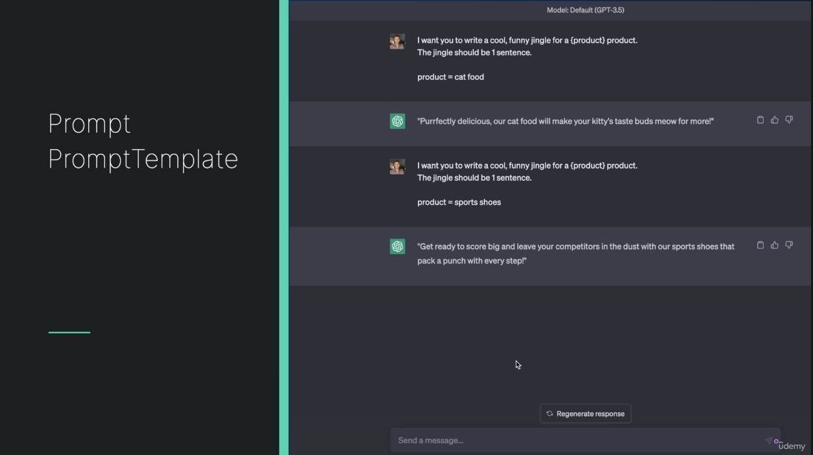
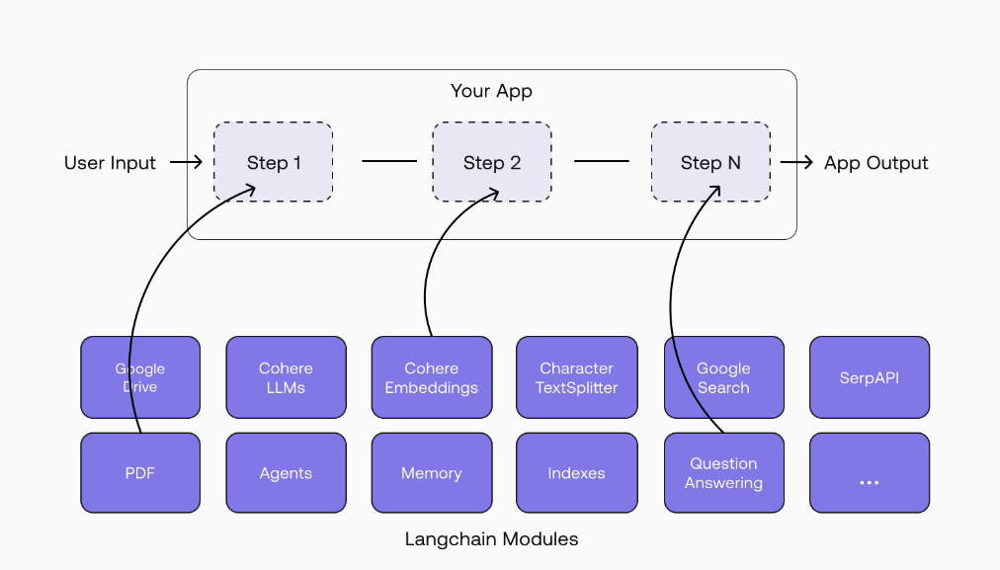

## 🧠 First LangChain Program: Prompt Template, Chat Models & Chains

---

### 📦 **Intro**

This hands-on session by Eden introduces you to the **core building blocks** of LangChain through a simple yet functional Python script. You’ll write your first program that sends a prompt to an LLM, processes it, and outputs structured results. In the process, you’ll learn about:

- ✅ Prompt Templates

  - Well, large language models receive as input something, which is called a prompt. What is a prompt? Is simply text input that we give the LLM and the LLM processes it and returns us an output. However, when we're dealing with programmatic access to the LLM, then we might want to take a prompt and to give it parameters. So one time I want to run this prompt where the product is cat food, the other time where the product is sports shoes, and for the last time, let's say I want to run it where the product is a piano, okay?



- ✅ Chat Models

  - Wrappers around LLMs that help us interact with them as we would in a chat message
  - You can think about it and text in, text out. But in the future it will also offer a lot more things to do with.


- ✅ LLM Chains

  - They allow us to combine multiple components together and create one single coherent application.



- ✅ `.env` setup & API keys
- ✅ LangChain's hidden magic ✨

---

### 📝 **Summary**

You’ll build a program that:

1. Accepts user input about a person 🧍
2. Sends a prompt to GPT-3.5 using LangChain 📤
3. Receives a structured response with a summary and two facts 🧾
4. Uses `.env` to manage API keys securely 🔐
5. Demonstrates LangChain’s modular design and simplified dev workflow 🔁

---

### 🪜 **Step-by-Step Example: Hello LangChain**

#### 1️⃣ Imports

```python
from langchain.prompts import PromptTemplate
from langchain.chat_models import ChatOpenAI
from dotenv import load_dotenv
import os
```

#### 2️⃣ Load Environment Variables

```python
load_dotenv()
```

#### 3️⃣ Define Prompt Template

```python
summary_template = """
Given the information about a person,
create:
1. A short summary
2. Two interesting facts about them.

Information: {information}
"""

prompt = PromptTemplate(
    input_variables=["information"],
    template=summary_template
)
```

#### 4️⃣ Initialize Chat Model

```python
llm = ChatOpenAI(
    model_name="gpt-3.5-turbo",
    temperature=0
)
```

- Temperature is how creative it will be. 0 means no creativity.

#### 5️⃣ Create Chain

```python
chain = prompt | llm
```

> `|` is from **LangChain Expression Language** — think of it like piping a prompt into an LLM 🧠

#### 6️⃣ Provide Input & Run

```python
info = "Elon Musk is the CEO of SpaceX and Tesla. He was born in South Africa..."
response = chain.invoke({"information": info})

print(response)
```

---

### 🔐 **Environment Setup: API Key Handling**

#### .env File

```env
OPENAI_API_KEY=sk-...
LANGCHAIN_TRACING_V2=false
```

- Place this file in the root of your project.
- Use `load_dotenv()` to pull keys in your code.
- NEVER commit `.env` to GitHub ❌

#### OpenAI Key Setup

- Visit [OpenAI dashboard](https://platform.openai.com/account/api-keys)
- Generate key → Copy → Paste in `.env`

#### LangSmith Note (2025 Update)

LangChain now **traces LLM calls by default**.

- Avoid 403 errors by adding:

  ```env
  LANGCHAIN_TRACING_V2=false
  ```

---

### 🔁 How LangChain Makes Life Easy

| Task             | Traditional Python   | With LangChain   | Emoji    |     |
| ---------------- | -------------------- | ---------------- | -------- | --- |
| Create prompt    | Manual string format | `PromptTemplate` | 🧾       |     |
| Access LLM       | Manual client setup  | `ChatOpenAI`     | 🤖       |     |
| Structure flow   | Custom code logic    | Chains (\`       | \` pipe) | 🔗  |
| API key handling | Manual headers       | Auto from `.env` | 🔐       |     |

---

### 🧠 Key Concepts Recap

| Concept           | Purpose                                 | Emoji                                |     |
| ----------------- | --------------------------------------- | ------------------------------------ | --- |
| `PromptTemplate`  | Dynamic, reusable prompt definitions    | ✍️                                   |     |
| `ChatOpenAI`      | Chat interface with OpenAI's GPT models | 💬                                   |     |
| `LLM Chain`       | Combine prompts + LLMs into flows       | 🔗                                   |     |
| \`                | \` Operator                             | LangChain Expression Language (LCEL) | ⛓️  |
| `.env` + `dotenv` | Secure API key handling                 | 🔐                                   |     |

---

### ⚖️ Pros & Warnings

#### ✅ Pros:

- Intuitive and modular codebase 🔧
- No need to manually initialize clients 🚫
- Dynamic prompts for reusable logic ♻️
- Great for chaining logic (e.g. prompt ➝ lookup ➝ re-prompt) 🔁

#### ⚠️ Warnings:

- Must use `.env` and not hardcode secrets ⚠️
- Ensure your runner (VSCode/PyCharm) loads `.env` or sets ENV vars 🌍
- Be aware of tracing defaults in 2025 version 🚨

---

### 🛠️ Real Debug Tips

- ❌ Missing `OPENAI_API_KEY` will cause runtime errors
- ✅ Add LangChain tracer opt-out: `LANGCHAIN_TRACING_V2=false`
- 💡 Use `chain.invoke({...})` to pass prompt variables cleanly

---

### ✅ What You Accomplished

You now have:

- A working LLM-powered script using LangChain 🧠
- A secure way to manage API keys 🔐
- Understanding of the fundamental building blocks of LangChain apps 💡

---

### 🚀 What’s Next?

You're ready to move beyond hello-world! Coming up:

- 📥 Output parsers
- 🧠 Memory handling
- 🛠️ Tools & agents
- 📦 Full-stack LLM applications

This was your first real taste of LangChain magic ✨
Let’s keep building! 🔧🔥
