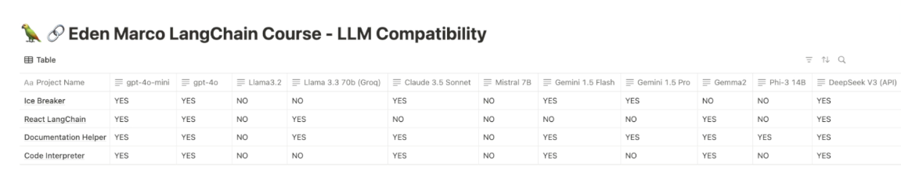

## 🤖 Choosing the Right LLM for Each Project in the Course

---

### 🧠 **Intro**

AI Eden (the instructor’s avatar) breaks down how to select the best **Large Language Model (LLM)** for each hands-on project in the course. Whether you want to use OpenAI, Claude, Gemini, or open-source models like LLaMA or DeepSeek, there's a tested path for each.

---

### 📝 **Summary**

- A **reference table** (linked in course resources) maps each project to a recommended LLM.
- You can complete the **entire course for free** by using **Gemini on Vertex AI** (comes with **\$300 free credits**).
- Eden uses **OpenAI** for his demos, but all projects are compatible with other providers too.
- Open-source models like LLaMA, Gemma, and DeepSeek are viable alternatives for local runs.



---

### 📋 **Project-to-Model Recommendations**

| Project                     | Ideal LLMs                               | Emoji |
| --------------------------- | ---------------------------------------- | ----- |
| **Conversational Bot**      | GPT-4, Claude 3, Gemini Pro              | 💬    |
| **Icebreaker (Intro)**      | Any model incl. LLaMA / Mistral          | ❄️    |
| **Agentic React Algorithm** | GPT-4, Claude 3.5 Sonnet (for reasoning) | 🤖    |
| **Documentation Helper**    | Gemini, GPT-3.5 / Claude                 | 📄    |
| **Code Interpreter**        | OpenAI (GPT-4), DeepSeek Coder           | 💻    |

📌 Full compatibility chart is in the **course resource table**.

---

### 💸 **Cost-Saving Tip**

- **Vertex AI Gemini** offers **\$300 credits**
- ✅ That’s **enough to do the full course for free**
- ⚡ Use with LangChain and HuggingFace with minimal latency

---

### 🔄 **Model Flexibility**

LangChain’s abstraction makes switching between models effortless:

```python
# Swap this:
from langchain.chat_models import ChatOpenAI
# With this:
from langchain_google_genai import ChatVertexAI
```

🔁 One line swap = new model, same app flow.

---

### 💬 **AI Eden's Final Word**

- All projects have been **benchmarked** across LLMs.
- Pick based on budget, availability, or preference.
- Feedback welcome on this **AI-generated video format** 🎥🤖

---

### ✅ Takeaway

You have total flexibility! Whether you prefer:

- Managed cloud services (OpenAI, Claude, Gemini) ☁️
- Free-tier experiments (Vertex AI) 💰
- Full local control (LLaMA, Gemma) 💻

LangChain + the model guide has you covered 🚀
