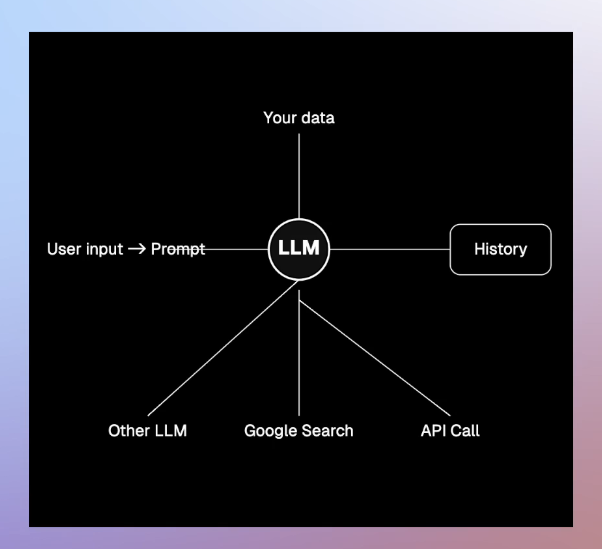
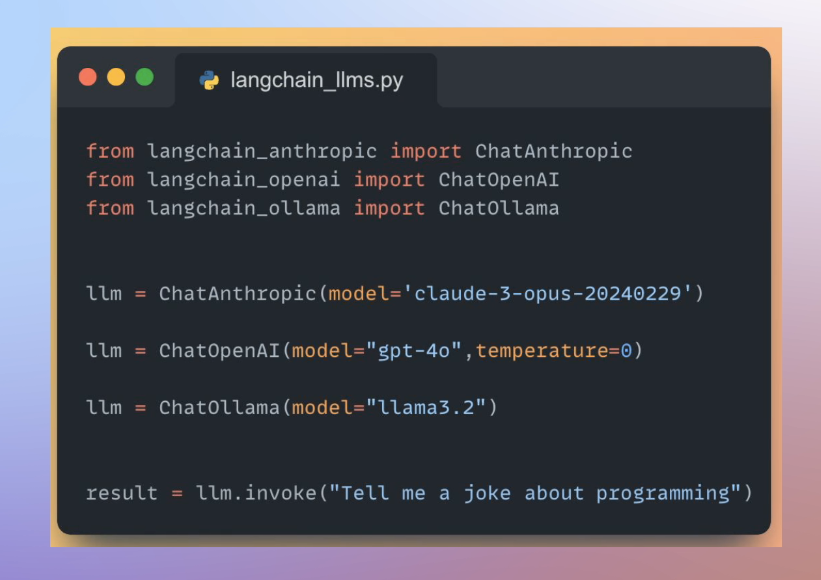

## ⚙️ What is LangChain? (Explained in Under 6 Minutes)

---

### 🧠 **Intro**

LangChain is an open-source framework that makes it easier to build powerful applications using Large Language Models (LLMs). It abstracts the complex parts of combining LLMs with external tools, your own data, and user interactions. This breakdown covers what LangChain is, why it matters, and how it helps developers get things done — fast and efficiently.

---

### 📝 **Summary**

LangChain simplifies building LLM-powered apps by:

- Abstracting LLM interactions 🧠
- Supporting RAG and agent architectures 🤖📚
- Integrating easily with personal data and external APIs 🌐
- Offering modular building blocks for composability 🧩

It’s ideal for software engineers who want to build with LLMs without learning the depths of ML or model training.

---

### 🔑 **Key Concepts & Tools in LangChain**

#### 🧠 LLM Abstraction

- One unified interface for multiple LLM vendors (e.g., OpenAI, Claude, Mistral).
- **Vendor-agnostic**: Easily switch LLMs without changing your code.

#### ✍️ Prompt Templates

- Create reusable prompt templates.
- Inject user input dynamically into prompts.
- Helps manage, optimize, and serialize prompts for different use cases.

#### 📄 Document Loaders

- Load data from various sources (Notion, PDFs, emails, databases, etc).
- Normalize all into `LangChainDocument` format for consistent processing.

#### 🤖 Agent Ecosystem

- Agents can **reason**, **decide**, and **act** using tools like:

  - Web search 🌍
  - API calls 🔌
  - Database queries 🗃️

- Agents built using:

  - **Tool abstraction**
  - **Agent Executors**
  - **LangGraph workflows**

#### 🧪 Production-Readiness

- **LangSmith**: Debugging and tracing tool 🐛
- Monitoring, logging, and alerting support
- Focus on building **real-world apps**, not just toy projects.

---

### 🧩 **Building Blocks in LangChain**

| Module               | Purpose                                      | Emoji |
| -------------------- | -------------------------------------------- | ----- |
| **LLM Interface**    | Interact with any LLM                        | 🧠    |
| **Prompt Module**    | Manage and inject prompts                    | ✍️    |
| **Document Loaders** | Load and process data sources                | 📄    |
| **Memory**           | Save chat history and context                | 💾    |
| **Agents**           | Empower LLMs with decision-making + tool use | 🤖    |
| **LangGraph**        | Structure workflows with branching logic     | 🔀    |
| **LangSmith**        | Debug, monitor, and trace LLM chains         | 🔍    |

---

### 💡 **Real-World Example Use Case**

> 🛠️ You want to build an app using Claude Sonnet, connect it to your PDFs, inject user questions dynamically, save chat history, call external APIs, and switch to Mistral next week.
>
> 😰 Without LangChain: Multiple libraries, tools, formats, and plumbing required.
>
> 😎 With LangChain: Use unified abstractions, and you're good to go.

---

### 📚 **What You'll Learn in the Course**

- How to build **Agentic apps**
- How to build **RAG-based apps**
- How to switch LLMs effortlessly
- How to integrate your own data
- How to build for production 🧪🛡️
- How to use **LangSmith** for tracing/debugging
- Deep dive into LangChain source code — no magic, only transparency

---

### ⚖️ **Pros & Benefits**

✅ Open Source and free
✅ Massive community support
✅ LLM vendor agnostic
✅ Tons of modular functionality
✅ Suitable for production apps
✅ Designed for developers, not researchers

---

### 🚨 Challenges without LangChain

- Managing data from various sources manually 📦
- Building complex workflows from scratch 🔩
- Integrating multiple LLM APIs 🤯
- Lack of debug tools without LangSmith 🧯

---

### 🚀 Final Take

LangChain is like the **React.js of LLMs** — it brings structure, reusability, and productivity to the world of GenAI app development. Whether you're building an agent, a chatbot, a research assistant, or a workflow orchestrator, LangChain helps you turn ideas into working software — fast 💨

And yes, this was just the tip of the iceberg 🧊… the rest of the course dives deep!
