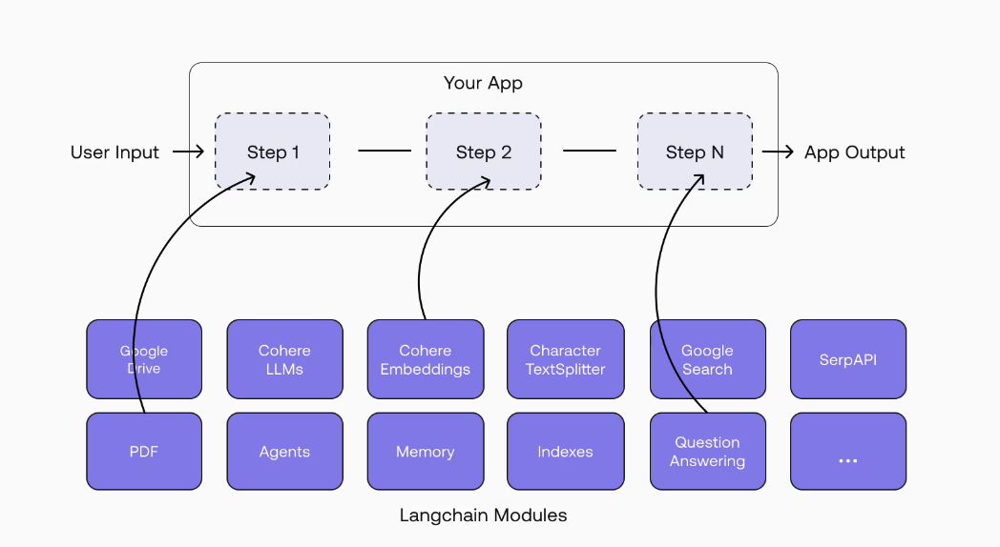

## ⚙️ LangChain Project Setup — From Zero to Running Code

---

### 🧠 **Intro**

This setup session with Eden lays the foundation for all future LangChain development. It walks you through cloning the starter project, setting up a virtual environment, installing key LangChain packages, and verifying everything works. Whether you're on PyCharm, VSCode, or even Vim — the process is lightweight and IDE-agnostic.

---

### 📝 **Summary**

In this setup tutorial, you'll:

- Clone the starter branch from the course repo 🧬
- Create a virtual environment with **Pipenv** 🐍
- Install essential LangChain packages 📦
- Set up your IDE to run and debug (example shown in PyCharm) 🛠️
- Write your first dummy Python file to verify setup ✅
- Install and configure `black` as a code formatter 🎨

By the end, your dev environment will be ready to build LangChain apps!

---

### 🧩 **Step-by-Step Setup Guide**

#### 1️⃣ Clone the Repo

```bash
git clone -b 1-start-here <repo-url>
```

- Make sure you're on the correct branch: `1-start-here`.

#### 2️⃣ Open in Your IDE

- PyCharm is shown, but VSCode or Vim is totally fine.
- The course doesn't rely on any IDE-specific features.

#### 3️⃣ Configure Python Interpreter

- Go to **Preferences → Python Interpreter**
- Select or create a **Pipenv** interpreter
- Confirm it's properly initialized

#### 4️⃣ Create Pipenv Shell

```bash
pipenv shell
```

- Initializes `Pipfile`
- Creates virtual environment

#### 5️⃣ Install Required Packages



```bash
pip install langchain
pip install langchain-openai
pip install langchain-community
pip install langchainhub
```

💡 **Why split packages?**
LangChain used to be monolithic. Now it's modular:

- `langchain`: Core functionality 🧠
- `langchain-openai`: OpenAI integration 🔗
- `langchain-community`: Text splitters, output parsers, and misc tools 🌍
- `langchainhub`: Community-contributed prompts 📚

This avoids unnecessary SDKs and improves maintainability.

#### 6️⃣ Create Starter Script

File: `icebreaker.py`

```python
if __name__ == "__main__":
    print("Hello LangChain")
```

✅ Run it to ensure setup works.

#### 7️⃣ Configure a Run Configuration

In PyCharm:

- Add a new runner: ➕ → Python
- Name: `Icebreaker Runner`
- Script Path: path to `icebreaker.py`
- Apply and run!

#### 8️⃣ Install Code Formatter

```bash
pipenv install black
black .
```

🧼 Automatically formats your code to look clean and consistent.

---

### 🔑 **Key Concepts Introduced**

| Concept               | Purpose                              | Emoji |
| --------------------- | ------------------------------------ | ----- |
| **Chains**            | Sequence of actions in an LLM app    | 🔗    |
| **LLM Abstraction**   | Interact with any model via same API | 🧠    |
| **Modular Packaging** | Install only what you need           | 📦    |
| **Pipenv**            | Package + environment manager        | 🐍    |
| **LangChainHub**      | Download reusable community prompts  | 📚    |

---

### ⚖️ **Pros & Tips**

#### ✅ Pros:

- Lightweight and IDE-agnostic setup ⚖️
- Modular and maintainable package structure 🧱
- Community-driven enhancements (LangChainHub) 🌍

#### 💡 Tips:

- Stick with **Pipenv** for consistency with the course
- Use `black` regularly to keep code clean
- Modular packages save space and install time
- You can swap LLM vendors by just changing one import 🤯

---

### 🏁 **Milestone Achieved**

🎉 You’ve officially completed the “boring” part — the setup.
You're now ready to write real LangChain-powered LLM applications!

Let’s go build something powerful! 💥
