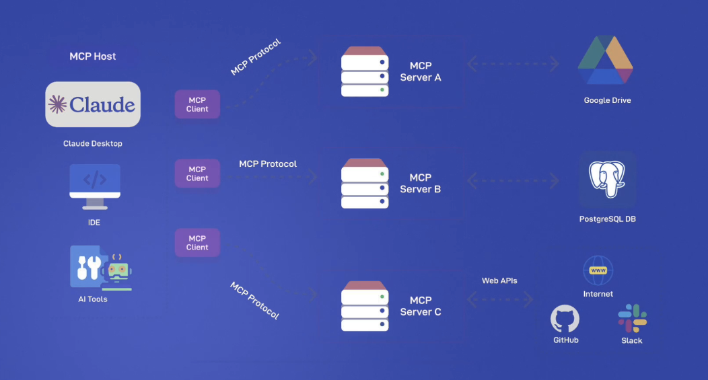

**🧠 Intro**

Eden gives a high-level overview of the **MCP (Model Context Protocol) architecture**, its purpose, real-world use cases, and the design philosophy behind the protocol. This segment bridges foundational understanding and practical implementation by summarizing how MCP helps **standardize context provisioning to LLMs** across multiple applications.

---

**📚 Summary**

- **MCP is a standardized protocol** for enriching LLMs and AI applications with external tools, prompts, and resources.
- It enables **plug-and-play integrations**—developers write functionality once and connect it to any MCP-compatible AI host (like Cursor or Cloud Desktop).
- Eden uses an example where an MCP server integrates with Uber Eats to allow an LLM to **order food** via tool invocation, highlighting MCP’s real-world potential.
- He introduces the idea of **MCP clients**, **hosts**, and **servers**, along with their roles and relationships.
- Finally, Eden previews the components of MCP and the technical capabilities that make this architecture **modular, scalable, and powerful**.

---

**🗝️ Key Concepts**

### 🔌 What is MCP?

- A **protocol that standardizes how LLMs receive and interact with context**, tools, and data.
- Context isn’t just extra info—it includes:

  - 🧠 Prompt content
  - 🧰 Tool availability
  - 📁 Resource data (PDFs, files, APIs)

---

### 🌉 Why MCP is a Game-Changer

- **Reusability**: Build once, integrate everywhere.
- **Vendor independence**: Tools are not tied to specific AI vendors (e.g., OpenAI, Anthropic).
- **Composable design**: Mix and match tools across multiple LLM applications.
- **USB-C Analogy**: Just like USB-C ports allow interoperability between hardware, MCP enables that between AI apps and tool servers.

---

### 🍽️ Example: Uber Eats Integration

- An MCP server is connected to **Eric Dickerson's Uber Eats account**.

[Uber Eats MCP Server](https://github.com/ericzakariasson/uber-eats-mcp-server)

- Cursor (as an MCP host) can:

  - Understand user intent to order food.
  - Use tools exposed by the server to:

    - Fetch menu options
    - Filter dishes
    - Place the order

- All through **natural language + tool invocation**.

---

### 🧩 MCP Core Components

| Component        | Description                                         |
| ---------------- | --------------------------------------------------- |
| **MCP Host**     | The AI app (e.g., Cursor, Claude Desktop, Windsurf) |
| **MCP Server**   | Provides tools, prompts, or data                    |
| **MCP Client**   | Embedded in the host; connects to the server        |
| **MCP Protocol** | The standard set of methods for communication       |

---

### 🧱 Examples of What MCP Servers Can Expose

- 📂 **Resources**: Text files, PDFs, search results
- 🛠️ **Tools**: Functions/APIs that can be called (e.g., weather lookup, database query)
- 💬 **Prompts**: Structured templates with dynamic slots

---

### 🔁 Communication Pattern

- **MCP Client ↔ MCP Server** using the MCP protocol (e.g., over stdio or SSE).
- **1:1 Mapping**: One client talks to one server.

  - If an app needs to connect to multiple servers, it needs **multiple clients**.

---

### ⚡ Advantages of MCP

| Benefit                | Explanation                                                         |
| ---------------------- | ------------------------------------------------------------------- |
| 🔌 Plug-and-play tools | Integrate tools like weather, food ordering, etc. without rewriting |
| 🔁 Reuse across apps   | Connect a tool to Cursor, Cloud, or your own LLM app                |
| 🚫 No vendor lock-in   | Works with any LLM-compatible app implementing the protocol         |
| 🧩 Extensible design   | Easily add prompts, tools, and resources                            |
| 🛠️ Cross-platform      | Works with Python, Node.js, Java, etc.                              |

---

### 🔁 Comparing MCP with LangChain

- 🧩 **LangChain**: Modular building for chains, tools, memory, etc.
- 🔗 **MCP**: Communication layer and interface standard.
- ✅ **They can be used together**. They solve different but complementary problems.

---

**💡 Tips & Takeaways**

- Always think of **MCP as a protocol**, not just a library or framework.
- Use **descriptive metadata** (tool names, descriptions) to help LLMs choose the right tool.
- Your **tools are portable** — once exposed via MCP, they can be used anywhere the protocol is supported.
- Remember: **1 MCP client = 1 server**. Multiple servers? Use multiple clients.

---

**🔜 Coming Up**

> In the next video, Eden will break down the **core components of the MCP protocol**:
>
> - Required methods (`listTools`, `callTool`, `listPrompts`, etc.)
> - How to implement them inside a server
> - How MCP clients interact with them

You now have the full architectural picture—next, you'll learn how to implement the protocol's core in your own servers. 🛠️🌐📦
