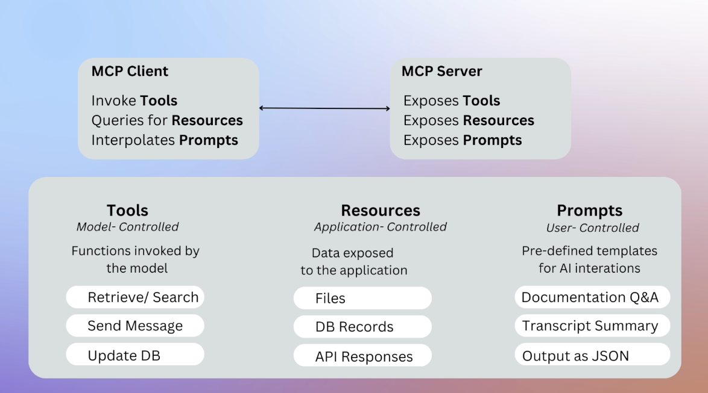

**🧠 Intro**

Eden provides a comprehensive view of **MCP servers** — what they expose, how they’re built, how they run, and what the future holds for the **MCP ecosystem**. This lecture is a foundational insight into the **flexibility, power, and scalability** of MCP, touching on both current capabilities and exciting future developments like registries, verification, and evolving agents.

---

**📚 Summary**

- MCP servers are **standardized interfaces** that expose tools, resources, and prompts to AI applications (MCP hosts).
- These servers are modular, allowing developers to **federate access to any external system** (Stripe, weather APIs, databases, etc.).
- MCP servers can be **built manually**, **generated with AI**, or **sourced from the community or vendors**.
- They can run **locally**, **remotely**, or in **containers** and support composability between agents.
- The future of MCP includes **verification**, **centralized registries**, **authentication**, and **agent-level discovery** of new capabilities.

---

**🗝️ Core Interfaces MCP Servers Expose**

1. **🛠️ Tools**

   - Functions LLMs can invoke (e.g., `getForecast`, `orderFood`).
   - Full developer freedom — can read/write from/to any system.
   - LLMs decide when to invoke based on context.

2. **📁 Resources**

   - Contextual data passed to the LLM.
   - Can be **static** (PDFs, JSON, text) or **dynamic** (fetched API responses in real-time).
   - Gives LLMs access to rich background info.

3. **💬 Prompts**

   - Reusable, template-based interactions.
   - Useful for **standardizing complex conversations** or requests.

---

**🧱 How to Build MCP Servers**

| Method               | Description                                                                |
| -------------------- | -------------------------------------------------------------------------- |
| 📝 Manual Coding     | Write in Python or Node.js (100–200 lines). Full control.                  |
| 🤖 AI-Generated      | Tools like Cursor or MCP Generator help scaffold quickly.                  |
| 🌍 Community Servers | Thousands available on GitHub. Clone and extend.                           |
| 🏢 Vendor-Maintained | Companies like Stripe and Cloudflare provide official open-source servers. |

> 💡 **Don’t reinvent the wheel**: Always check if a server already exists before building one from scratch.

[Community Build MCP](https://mcp.so/)

---

**🖥️ How MCP Servers Can Be Run**

| Mode                       | Details                                      |
| -------------------------- | -------------------------------------------- |
| 🖥️ **Local (stdio)**       | CLI-based, used by Cursor and Cloud Desktop. |
| 🌐 **Remote (SSE or SSH)** | For cloud-deployed servers.                  |
| 🐳 **Dockerized**          | Ideal for production deployments.            |

> 🧪 Future course content may include a Docker deployment walkthrough (let Eden know if you want it).

---

**📤 Extra Capability: Sampling**

- MCP servers can **ask the AI host to complete prompts**.
- Useful for prompting the LLM to generate something mid-process.
- Example: AI application asks the MCP server for a formatted response, and the MCP server uses the LLM itself to fill it in.
- Powerful but comes with **security and privacy risks**.

[MCP Sampling](https://modelcontextprotocol.io/docs/concepts/sampling)

---

**🔗 Composability**

- Any AI app or agent can be **both a client and a server**.
- Enables **layered agentic systems**:

  - Specialized agents serve tools to others.
  - Promotes reusability and clean separation of concerns.

---

**🔮 The Future of MCP**

| Feature                         | Description                                                                                                |
| ------------------------------- | ---------------------------------------------------------------------------------------------------------- |
| 🌐 **MCP Registry & Discovery** | Central directory for finding and publishing MCP servers.                                                  |
| ✅ **Server Verification**      | Mitigates **supply chain attacks** by marking official servers.                                            |
| 🤖 **Runtime Tool Discovery**   | Self-evolving agents could discover & integrate new tools at runtime.                                      |
| 🧭 **Web Exposure Standards**   | Websites may adopt `/.well-known/app.json` to expose MCP endpoints (like `robots.txt` for search engines). |
| 🔐 **Authentication Support**   | OAuth 2.0 and session tokens for secure, authorized access.                                                |
| 🔁 **Session Management**       | Tokens will help maintain persistent, secure sessions with servers.                                        |

---

**💡 Tips & Reminders**

- ✨ Use accurate descriptions for tools and inputs — they drive better LLM behavior.
- 🧠 You can extend official servers if you need more functionality.
- 📦 Clone and modify MCP servers as a starting point.
- ⚠️ Be cautious of unverified community servers — they can pose a security risk.
- 🔄 Composable agents = scalable AI workflows.

---

**🔜 Coming Up**

> In the next section, Eden will guide us into **implementing core protocol methods** (`listTools`, `callTool`, etc.) and configuring how MCP clients and hosts interact with servers in practice.

You're now armed with the strategic mindset and architectural clarity to begin building advanced, secure, and shareable MCP tooling ecosystems! 🔌⚙️📡
