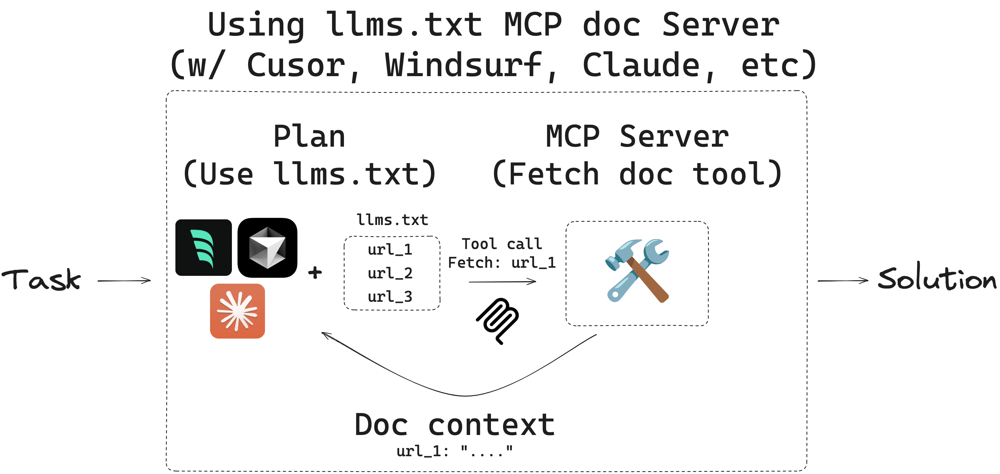

**📘 Intro**

In this video, Ethan demonstrates a complete hands-on integration of a real-time documentation-fetching **MCP server** using the `lm.txt` standard. This server is designed to dynamically retrieve **up-to-date documentation** from official sources like LangGraph, solving the problem of stale knowledge in AI-generated responses. Using **Cloud Desktop**, Ethan shows how the server plugs in via MCP, debugs setup issues, and ultimately proves its value by grounding LLM answers with fresh web content.

[MCP LLMS-TXT Documentation Server](https://github.com/langchain-ai/mcpdoc)



---

**📚 Summary**

- The showcased **MCP server scrapes live documentation** based on a site’s `lm.txt`.
- The LLM (via Cloud Desktop) uses tools exposed by the server to:

  1. Discover content structure from `lm.txt`.
  2. Identify relevant URLs.
  3. Fetch real-time content for answering.

- This workflow guarantees **non-stale**, **live data** for agent responses.
- Tools like **MCP Inspector** and careful terminal debugging help ensure the server is correctly configured and connected.

---

**🗝️ Key Components and Workflow**

### 🧠 Server Purpose

- Avoid indexing documentation statically (which quickly becomes outdated).
- Instead, **scrape live content** from official docs using the `lm.txt` index.
- Example target: LangGraph’s evolving documentation.

### 🧩 How It Works (Conceptually)

1. 📖 Load `lm.txt` = like a table of contents.
2. ❓ Parse the user's query (e.g., "What is LangGraph memory?").
3. 🔍 Select the relevant documentation section (via URL in `lm.txt`).
4. 🌐 Fetch and scrape that page content.
5. 📤 Provide a grounded, real-time answer.

---

**🔧 Setup & Execution**

### 📥 Clone & Prepare the MCP Server

```bash
git clone https://github.com/anthropic-ai/mcp-doc
cd mcp-doc
uv venv  # Create virtual environment
source .venv/bin/activate
uv pip install -r requirements.txt
```

### 🚀 Run the Server (SSE or stdio)

#### Example: Run with SSE and LangGraph docs

```bash
uv run main.py --doc-url=https://docs.langgraph.dev/py/lm.txt
```

- Runs on port `8082` (SSE mode)
- Later tested with **Cloud Desktop** in `stdio` mode on port `8081`

---

**🧪 Testing with MCP Inspector**

1. Start Inspector via:

   ```bash
   npx mcp-inspector
   ```

2. Connect to `localhost:8082`
3. View exposed tools:

   - `list_doc_sources`: Returns the `lm.txt` URL
   - `fetch_docs`: Scrapes and returns content from a given URL

4. Use input fields to test tool output

---

**⚙️ Cloud Desktop Integration**

1. 🧑‍💻 Go to:

   ```
   Settings → Developer → MCP Config
   ```

2. 📝 Paste the config snippet:

   ```json
   {
     "name": "lm-docs",
     "command": "/absolute/path/to/uv",
     "args": [
       "run",
       "main.py",
       "--doc-url=https://docs.langgraph.dev/py/lm.txt"
     ],
     "transport": "stdio",
     "port": 8081
   }
   ```

3. 🧪 Restart Cloud Desktop

4. ✅ Use the MCP Tool:

   - Ask: "What is LangGraph memory?"
   - Agent:

     - Runs `list_doc_sources`
     - Gets URL to `lm.txt`
     - Runs `fetch_docs` on the `.txt` to find structure
     - Selects the **memory** URL
     - Runs `fetch_docs` again to retrieve memory content
     - Responds with real-time, grounded documentation

---

**🐞 Debugging Tips**

- ❗ Errors running `uv`?

  - Use `which uv` to find the full path
  - Use absolute paths in `command`

- 🧪 Always restart Cloud Desktop after MCP config changes
- ✅ Use Inspector to verify server and tool health before integration

---

**🌟 Key Benefits**

| Feature                              | Impact                                                             |
| ------------------------------------ | ------------------------------------------------------------------ |
| 🕒 Real-time scraping                | Keeps docs fresh, avoids stale answers                             |
| 🧰 Modular MCP tools                 | Easily plugged into multiple apps (Cursor, Cloud, Windsurf)        |
| 🔍 Structured discovery via `lm.txt` | Helps agents reason about site layout                              |
| 🧠 LLM reasoning + scraping tools    | Auto-fetch only what’s relevant                                    |
| 📎 `lm.txt` = Index                  | `lm-full.txt` = Full data dump (for offline use, vector embedding) |

---

**🆚 Comparison: Trained Model vs. Live Integration**

| Without MCP               | With MCP                         |
| ------------------------- | -------------------------------- |
| Answer from training data | Answer from live scraped content |
| May be outdated           | Guaranteed fresh                 |
| No explainability         | Shows tool chain + source        |
| Passive                   | Interactive, agentic             |

---

**🔐 Security Note**

- Server fetches public content, but always ensure scraping obeys `robots.txt`.
- MCP servers could be extended to support authentication for gated APIs.

---

**🔜 Coming Up**

> Ethan will:
>
> - Dive deeper into prompt use with `lm.txt`
> - Explore real-time vs. cached retrieval trade-offs
> - Possibly demo Docker deployments or remote integrations

This was a powerful demo of how MCP + `lm.txt` can create **live, smart, and grounded agents**. 🚀📖🤖
