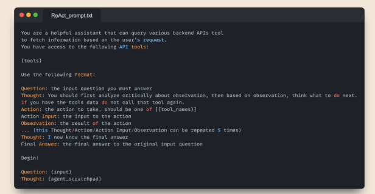

## 🧠 Understanding MCP by Looking Back at LLMs and Tool Usage

Eden walks us through the foundational concepts needed to fully grasp MCP (Model Context Protocol) by tracing back the roots of LLMs, demystifying how **tool usage actually works**, and clarifying how MCP standardizes and unlocks reusable tooling across LLM applications.

---

### 🔡 LLMs: Just Fancy Token Generators


Let's start with a critical reminder:

- **LLMs are not magical agents.**
- At their core, they are **statistical models** trained to **predict the next token** in a sequence.

✅ What LLMs _can_ do:

- Generate text (and with multimodal models, maybe also images or audio).

🚫 What LLMs _can’t_ do on their own:

- Browse the web 🌐
- Run Python code 🐍
- Access databases 🗃️
- Perform any real-world actions ⚙️

These capabilities must be **added externally**, in the form of **tooling implemented by software engineers**.

---

### 🧰 Tool Usage Is an Application-Layer Feature

When you ask something like:

> “What’s the weather in Tokyo right now?”

The LLM _does not know_ the current weather—it _generates_ an **intent** like:

```json
{
  "tool_call": "get_weather",
  "args": { "location": "Tokyo" }
}
```

This **structured output** is:

- **Not magical**, but the result of a **well-crafted system prompt**
- **Easy to parse** by the application wrapping the LLM (e.g., ChatGPT, Cloud Desktop)
- **Triggering** an actual function that lives in the application's code

➡️ So, the app receives the tool call, runs the real function (e.g., calls a weather API), and passes the result back to the LLM for generating a **final response**.

📦 **This is the agent loop**:

1. LLM generates a tool call
2. App runs the tool
3. LLM gets tool result + original query
4. LLM answers using both



---

### 🎯 Tool Calling Is Not Perfect

Since LLMs are just token predictors:

- Tool calls can **fail**, be incomplete, or slightly off.
- But in practice, **LLMs are good enough** at this that agentic apps are highly functional.

---

### 🧩 Where MCP Comes In

Most apps today **roll their own** tool calling:

- Each with different formats, APIs, schemas, naming.

🤯 This results in:

- Fragmentation
- Duplicate tooling
- Compatibility nightmares

💡 **MCP (Model Context Protocol)** changes that:

> It’s a **standard** for exposing tools (and other resources) in a way that **any LLM client** can understand and use.

With MCP:

- Developers write and expose tools via **MCP servers**
- Clients like **ChatGPT, Cursor, Cloud Desktop** can **discover and invoke** these tools automatically
- It standardizes the **format, metadata, and communication protocol**

📌 You’re not just writing “tools for your app” — you’re building **interoperable tools for the ecosystem**.

---

### 🔗 ChatGPT, Cursor & Others Will Support MCP

- OpenAI has announced upcoming support for MCP
- Tools you expose today using MCP will **automatically integrate** with MCP-compliant clients tomorrow
- MCP becomes the bridge between:

  - Tool developers 🔧
  - Agent frameworks 🤖
  - LLM clients 💬

---

### 🧠 Summary

| Concept             | Explanation                                                                  |
| ------------------- | ---------------------------------------------------------------------------- |
| **LLMs**            | Predict the next token; that’s all                                           |
| **Tool Calls**      | Structured outputs generated by the LLM in response to smart prompting       |
| **Execution Layer** | External app code parses tool calls and runs real-world actions              |
| **MCP**             | Standardizes tool exposure so any LLM client can discover and use your tools |
| **Value**           | Reusability, interoperability, and ecosystem-wide integration 🚀             |

---

Let me know if you’d like a **visual diagram** of the flow from LLM → tool call → tool response → final answer using MCP!
