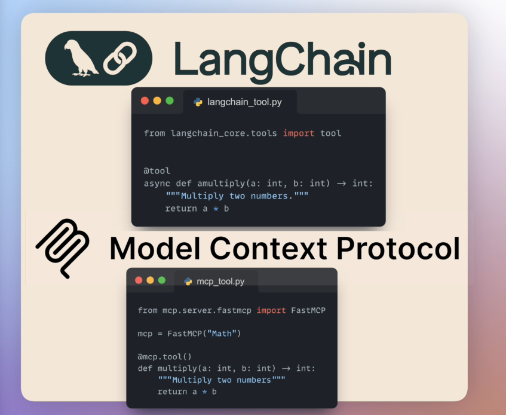
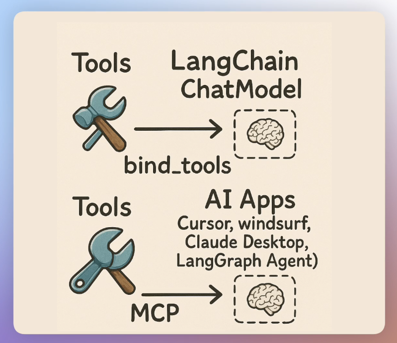
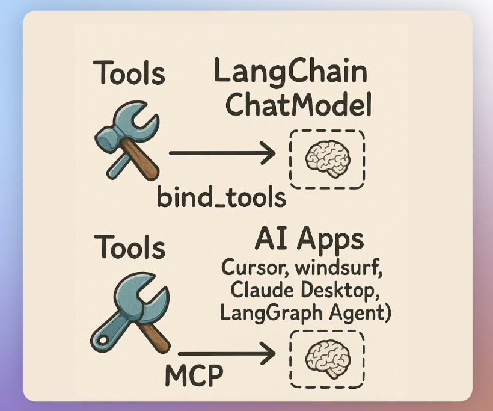
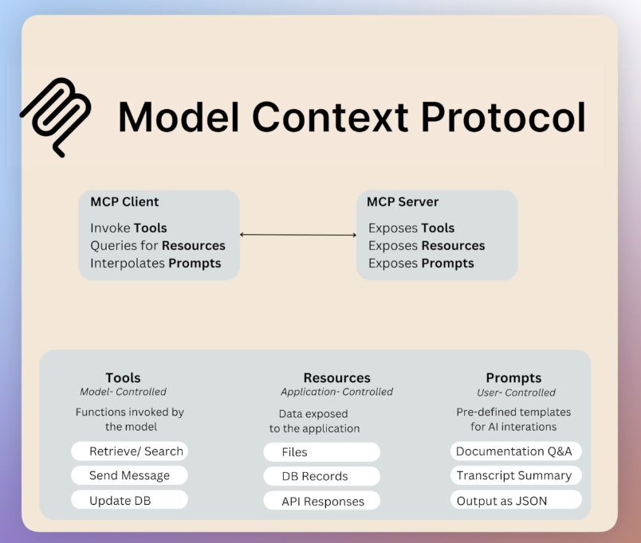
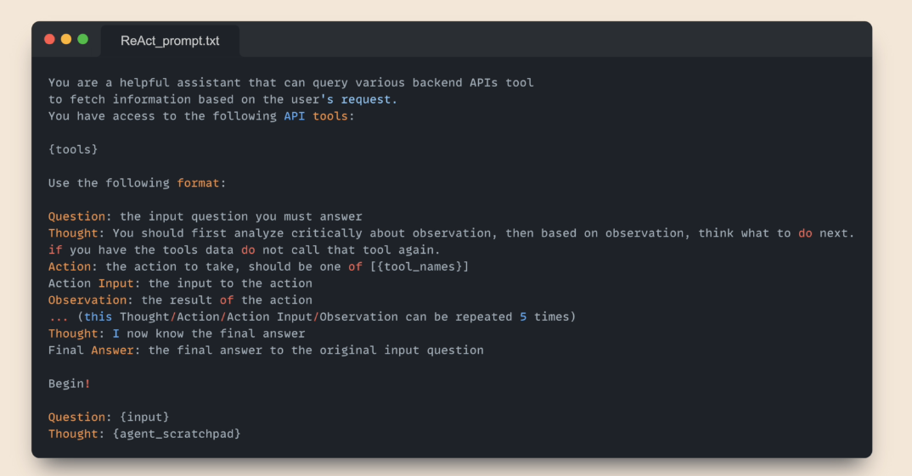

## 🔁 Comparing LangChain and MCP: Tooling, Interfaces, and Integration

Eden breaks down the **shared philosophy** between [LangChain](https://www.langchain.com) and [MCP](https://github.com/modelcontext/mcp), and then draws a **clear line** between how each system interacts with tools, clients, and LLMs. Finally, he introduces the **LangChain MCP Adapter**, which bridges both ecosystems.

---

### 🛠️ Shared Concepts: Tools in LangChain & MCP

At their core, **both LangChain and MCP** revolve around the concept of **tools**, which are:

- 🔧 **Externally defined functions** (written by devs, not LLMs)
- 📥 Receive **arguments**
- 📤 Produce **return values**

#### 🔍 Tools must have:

1. **Function signature**: inputs + outputs
2. **Description**: critical for LLM to decide when to invoke
3. **Structured metadata**: helps agent frameworks parse, match, and call

This idea powers **tool use** in both ecosystems:

- LangChain: LLMs decide to invoke a "bound" tool
- MCP: MCP clients expose tools to LLMs via a well-defined protocol

---

### 🧰 Toolkits vs. MCP Servers

| LangChain 🧠                       | MCP 🌐                                            |
| ---------------------------------- | ------------------------------------------------- |
| `Toolkit` = group of tools         | `MCP Server` = group of tools                     |
| Bound directly to the LLM          | Bound to the AI application (e.g., Cursor, Cloud) |
| Description passed into LLM prompt | Description passed via MCP client layer           |

➡️ In both cases, tools become **interfaces** between models and external execution logic.

---

### 🚧 Key Differences

| Feature                       | LangChain                      | MCP                                                |
| ----------------------------- | ------------------------------ | -------------------------------------------------- |
| **Exposure Target**           | Directly to the LLM            | To the **AI application** (e.g., Cloud Desktop)    |
| **Supports Resources**        | ❌ No                          | ✅ Yes (PDFs, prompts, APIs)                       |
| **Tool Calling Format**       | Proprietary binding in Python  | Protocol-based exposure                            |
| **Where Tool Metadata Lives** | Embedded into agent config     | Hosted by the MCP server                           |
| **Who Injects to LLM**        | You (as the dev) via LangChain | MCP **client** (e.g., Cloud) auto-injects into LLM |
| **Can Be Used Across Apps**   | No (tied to LangChain only)    | ✅ Yes (works with any MCP-compatible client)      |

---

### 🔄 Enter: LangChain MCP Adapter

💡 [**LangChain MCP Adapter**](https://github.com/langchain-ai/langgraph/tree/main/libs/langgraph-mcp-adapter) (Open source)

This project allows:

- ✅ **MCP tool → LangChain-compatible tool**
- ✅ **Multiple MCP servers → Connected into LangChain graph**
- ✅ Use of **existing tools** from other teams in your LangChain workflows without rewriting

📦 It includes:

- `MCPClient`: connects to MCP servers
- Tool wrappers: transforms MCP metadata into LangChain-compatible formats

---

### 🚀 Why This Matters

| Benefit                              | Explanation                                                                               |
| ------------------------------------ | ----------------------------------------------------------------------------------------- |
| 🔄 **Tool Reuse**                    | Leverage tools written in MCP across LangChain agents                                     |
| 🌍 **Cross-ecosystem compatibility** | LangChain agents can now tap into the broader MCP tooling world                           |
| 🤝 **Interoperability**              | Encourage shared standards, less duplication                                              |
| 🔧 **Modular AI infra**              | Tools live outside of LangChain and can be reused by Cloud Desktop, Cursor, ChatGPT, etc. |

---

### 📌 Summary

| Area               | LangChain                              | MCP                                        |
| ------------------ | -------------------------------------- | ------------------------------------------ |
| Main Purpose       | Agent framework & prompt orchestration | Standard protocol for exposing AI tools    |
| Tool Binding       | Direct to LLM                          | To the AI client (which then binds to LLM) |
| Supports Resources | ❌                                     | ✅                                         |
| Key Abstraction    | `Toolkit`, `Tool`                      | `MCP Server`, `Tool`, `Resource`, `Prompt` |
| Adapter Available  | ✅ LangChain MCP Adapter               | ✅ Enables tool interop                    |

---

Next up: a **hands-on walkthrough** using the [LangChain MCP client](https://github.com/langchain-ai/langgraph/tree/main/libs/langgraph-mcp-adapter) to connect to real MCP servers and invoke tools natively inside your LangChain agent workflows.
