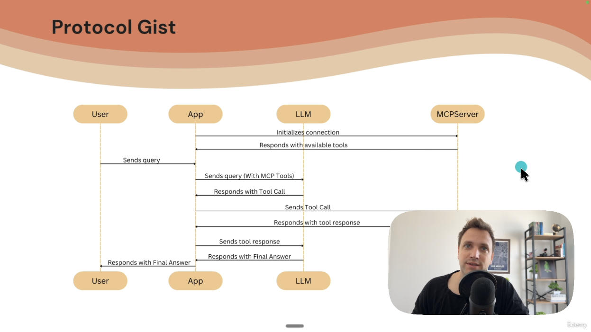
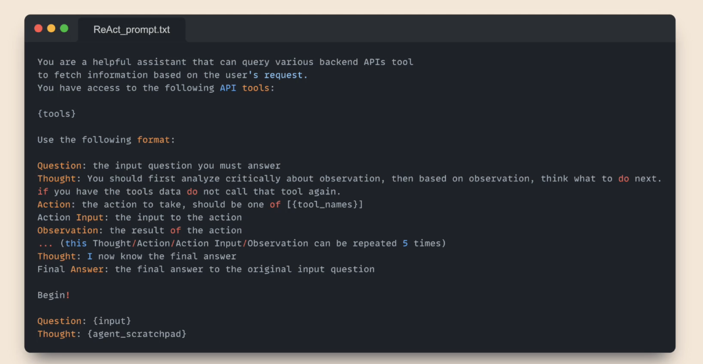

Here's a detailed **breakdown of the MCP protocol architecture** and the interactions between its components, as described by Eden, with emojis for clarity:

---

## 🧠 Overview of the MCP Protocol

### 🧍 User → 🧑‍💻 App (MCP Client lives here) → 🤖 LLM → 🔌 MCP Client → 🌐 MCP Server

---

### 🧩 Components

- 🧍 **User**: Sends the query (e.g., "What's the weather in California?")
- 🧑‍💻 **Application (Host)**: This could be Cloud Desktop, Cursor, Windsurf, etc.
- 🧠 **LLM (Large Language Model)**: Used to decide actions, generate responses, or call tools.
- 🔌 **MCP Client**: Lives inside the application, connects to one or more MCP servers.
- 🌐 **MCP Server**: Hosts **tools**, **resources**, and **prompts**.

---

## 🔄 Step-by-Step MCP Interaction Flow

### 1️⃣ **App Startup**

- MCP Client connects to MCP Server(s).
- MCP Server responds with a list of:

  - 🔧 Tools
  - 📄 Resources
  - 🧾 Prompts

- The app now "knows" what capabilities are available.

---

### 2️⃣ **User Input**

- User enters a prompt in the app (e.g., Cloud Desktop).
- The app **augments** the prompt with the available tools.

  - Example prompt sent to LLM:

    > “What’s the weather?”
    > _(Tool: `forecast(city: str)`)_

---

### 3️⃣ **LLM Response**

- LLM can:

  - 🗣️ Answer directly
  - 🛠️ **Call a tool** (e.g., `forecast(city="California")`)

---

### 4️⃣ **Tool Execution**

- 🔁 LLM’s tool call is **forwarded by the MCP Client** to the MCP Server.
- 🧪 **Tool is executed inside the MCP Server**, **not** the application.
- ✅ This creates **decoupling** between orchestration (app) and execution (server).

---

### 5️⃣ **Tool Response**

- MCP Server returns tool results to MCP Client.
- MCP Client delivers the result back to the app.

---

### 6️⃣ **LLM Second Round**

- LLM receives:

  - The original query
  - The tool's result

- LLM can then:

  - Continue processing
  - Make another tool call
  - Give the final user answer

---

### 7️⃣ **Final Answer**

- LLM sends final answer → App → User 🎉

---

## ⚙️ Comparison with LangChain

| Feature                         | LangChain                | MCP                    |
| ------------------------------- | ------------------------ | ---------------------- |
| 🧰 Tool Execution               | Inside app (agent layer) | On external MCP Server |
| 🔁 Decoupled from Orchestration | ❌                       | ✅                     |
| 📦 Deployment Model             | All-in-one               | Microservice-style     |
| 📈 Scalability                  | App-bound                | Cloud-native           |
| 🧪 Debugging                    | Local                    | Remote + isolated      |
| 🔄 Dynamic Tool Updates         | Manual                   | ✅ Via re-init         |

---

## ✨ Benefits of the MCP Model

- 🔌 **Standardized interface** for tool calling
- 🔧 **Loose coupling** between agent logic and tool logic
- 🌐 **Supports remote tools**, not just local functions
- 🚀 **Dynamic discovery of tools** during app lifecycle
- 📈 Better for **production, scaling, and debugging**

---

### 🧠 Insight: “LLMs are just token generators”

- All real-world action (web searches, function calls, file access) is handled by external tools.
- LLMs are guided via **system prompts** to produce structured tool calls.
- MCP enables managing this via a **protocol**, not hardcoded wrappers.

---

## 🛠️ Next Step

In the next part of the course, Eden will:

➡️ **Implement an MCP client inside a LangChain Graph Agent**
➡️ Show how this architecture simplifies integration and runtime behavior.

---

Let me know if you want a visual diagram of this flow!
