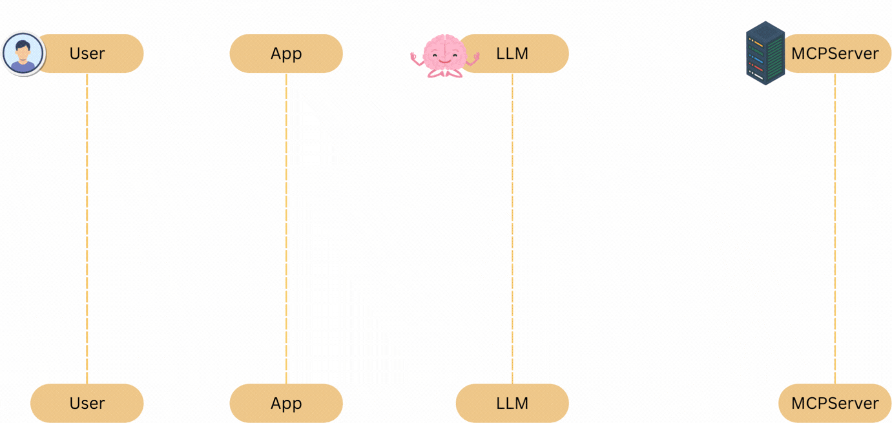

## 🧱 Project Boilerplate Setup for MCP LangChain Adapters

Eden walks through setting up a new project from scratch to implement MCP LangChain adapters, preparing the workspace, dependencies, and version control setup. Here's a full breakdown with emojis 🚀🛠️📦

[MCP Crash Course](https://github.com/emarco177/mcp-crash-course.git)



---

### 📦 Project Initialization

1. **Repo & Branch Setup**

   - Cloned the MCP Crash Course repo:

     ```
     git clone <repo-url>
     cd mcp-crash-course
     ```

   - Created a **new orphan branch** (disconnected from `main`) for the adapters:

     ```
     git checkout --orphan project/linkchain-mcp-adapters
     ```

2. **Clean Slate**

   - Removed all existing files:

     ```
     git rm -rf .
     ```

---

### ⚙️ Project Setup with `uv`

3. **Init New Python Project**

   ```
   uv init
   ```

4. **Created Virtual Environment**

   ```
   uv venv
   source .venv/bin/activate
   ```

5. **Installed Dependencies**

   ```
   uv pip install langchain-mcp-adapters langgraph langchain-openai python-dotenv
   ```

   ✅ `langchain-mcp-adapters` includes the base `mcp` package automatically.

---

### 🧪 Sanity Checks

6. **Verified Install with a Simple Script**

   - Edited `main.py`:

     ```python
     import asyncio
     async def main():
         print("What a beautiful program")
     asyncio.run(main())
     ```

7. **Executed Script in venv**

   ```
   uv run main.py
   ```

---

### 🔐 Environment Variables Setup

8. **Created `.env` file**

   ```env
   OPENAI_API_KEY=sk-...
   LANGCHAIN_API_KEY=...
   LANGCHAIN_ENDPOINT=https://...
   LANGCHAIN_PROJECT=MCP-Test
   LANGCHAIN_TRACING_V2=true
   ```

9. **Loaded `.env` in `main.py`**

   ```python
   from dotenv import load_dotenv
   import os
   load_dotenv()
   print(os.getenv("OPENAI_API_KEY"))
   ```

10. **.gitignore Config**

- Added:

  ```
  .env
  ```

---

### 🔃 Git Commit & Push

11. **Tracked & Committed Files**

```
git add .
```

12. **Used Cursor’s AI commit message generator** 🧠

13. **Pushed to Remote Branch**

```
git push --set-upstream origin project/linkchain-mcp-adapters
```

---

### 📁 Final File Structure

```
.
├── .env              # 🔐 Environment variables (ignored by Git)
├── .gitignore        # 📄 Prevents sensitive files from being tracked
├── main.py           # 🚀 Entry point with simple async function
├── pyproject.toml    # 📦 Dependency definitions
├── uv.lock           # 📌 Exact versions of packages
```

---

### ✅ Summary

- Created a clean and reproducible project setup for working with **MCP + LangChain**.
- Used `uv` for dependency and venv management.
- Added dotenv support for API keys.
- Project is now committed and pushed to GitHub for others to clone or pick up from.

Next step: Implementing the **first MCP client integration with LangChain!** 🔧🤝📡

Let me know if you’d like this as a downloadable setup checklist!
