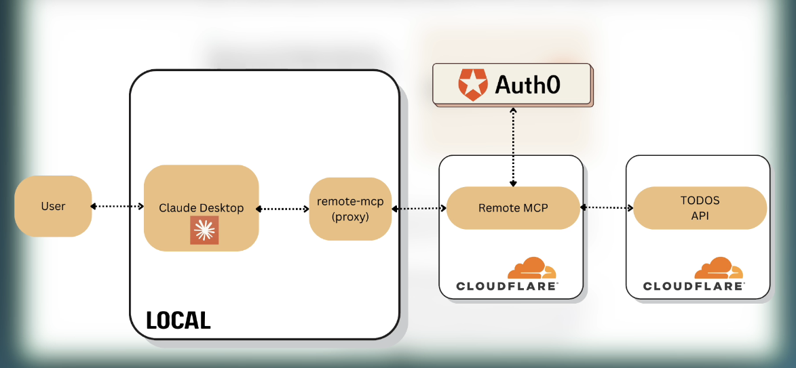

Here's a complete 🧠 **markdown-style breakdown** of Eden’s walkthrough on building a **secure remote MCP server using Auth0, Cloudflare Workers, and MCP Remote** — enabling protected cloud APIs to be accessed by AI apps like Cloud Desktop.



---

## ☁️ Project Overview

### 🧱 Goal

Build a **secure, remote MCP server in the cloud** that connects your **Cloud Desktop AI agent** to a **protected Todo API**, with full **authentication and authorization** via **Auth0**.

---

## 🗺️ Architecture Map

```
Cloud Desktop (local)
       |
       |  🛰️ connects through
       v
   MCP Remote (local proxy)
       |
       |  🌐 sends HTTP requests to
       v
 Remote MCP Server (Cloudflare Worker)
       |
       |  🔐 validates with Auth0
       v
Protected Todos API (Cloudflare Worker)
```

---

## 🧩 Components Explained

### 💻 Cloud Desktop

- Your AI app (MCP **host**)
- _Only_ supports **local** MCP connections
- Needs a proxy to reach remote servers

---

### 🔁 MCP Remote

- **Bridges** local MCP apps to **remote** MCP servers
- Proxies HTTP requests
- Handles communication securely
- Allows Cloud Desktop to **talk to cloud-based MCPs**

---

### ☁️ Remote MCP Server (Cloudflare Worker)

- MCP server hosted remotely
- **Wraps** your business logic (e.g., “get todos”)
- Talks to Auth0 to ensure secure access
- Forwards valid requests to the protected Todo API

---

### 🛡️ Auth0

- Manages **authentication and authorization**
- Ensures only permitted users or apps call the MCP server
- Issues and verifies **access tokens**

---

### 📋 Protected Todo API

- Also runs on **Cloudflare Worker**
- Implements basic endpoints (`/todos`, `/add`, etc.)
- Protected with **Auth0 middleware**
- Rejects unauthorized requests

---

## 🚧 Deployment Stack

| Service            | Purpose                                 |
| ------------------ | --------------------------------------- |
| Cloudflare Workers | Deploy both MCP & Todo API (serverless) |
| Auth0              | Auth & user session mgmt                |
| MCP Remote         | Bridge from local agent to remote MCP   |
| Cloud Desktop      | The AI app using MCP as host            |

---

## 🔍 Development Tips

- **Watch the video fully first** before implementing

  - Eden intentionally left in debugging moments to help you learn the _real-world challenges_

- Eden contributed to an [Auth0 blog post](https://auth0.com/blog/secure-and-deploy-remote-mcp-servers-with-auth0-and-cloudflare/) that inspired this flow

  - He pointed out it was missing info on **MCP Remote**, which caused hours of confusion

---

## 🧠 Why This Is Powerful

- ✅ **Real-world use case**: connect your AI to cloud APIs securely
- 🔒 Authenticated & authorized access to services
- ☁️ Deploy anywhere with Cloudflare Workers — no infra needed
- 🤖 Compatible with LLM agents like Cloud Desktop or Cursor
- 🧩 Modular architecture you can replicate for any secure cloud API

---

## 🚀 Next Steps in the Walkthrough

1. 🏗️ Build the protected **Todo API** with Auth0 middleware
2. 🧰 Create the **remote MCP server** that proxies to the API
3. 🔧 Set up **MCP Remote** on your local dev machine
4. 🔌 Connect Cloud Desktop to the MCP Remote
5. 🔐 Test Auth0 authentication & access controls
6. 🌐 Deploy both Cloudflare Workers (API & MCP)

---

Let me know if you'd like:

- A **visual diagram** of this architecture
- The **commands and file templates** used in each part
- A **step-by-step guide** to deploying it with your own Auth0 + Cloudflare setup
