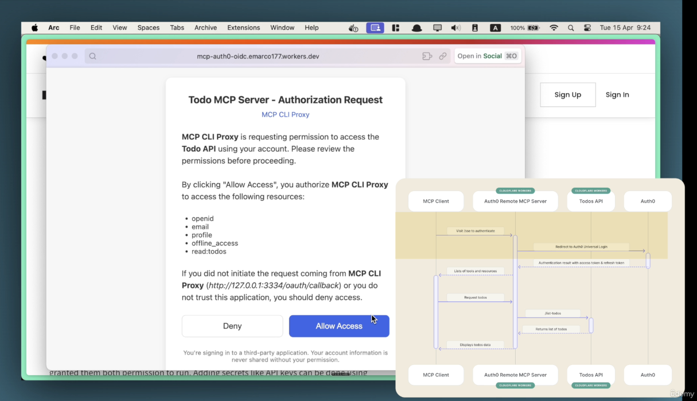
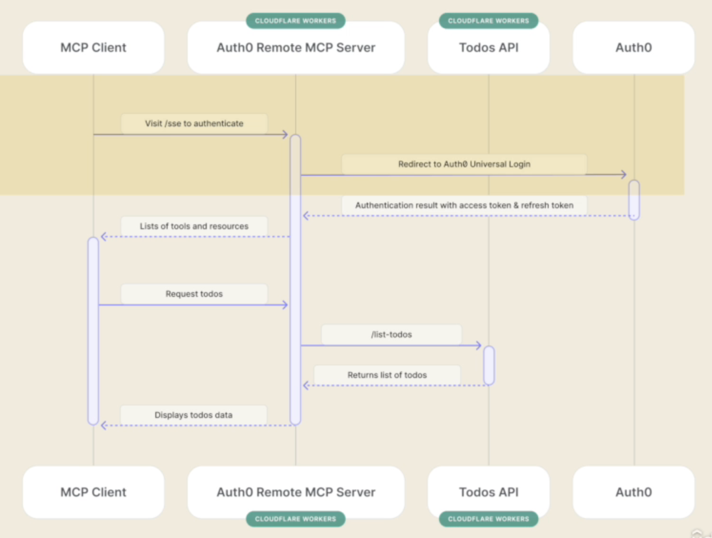

Here's the **markdown-style breakdown** of the secure OAuth2 demo Eden just walked through — showing the **final user experience** and what the **completed artifact** looks like when everything is working.

---

## 🧪 Demo: What You’ll Build

### ✅ Final Goal

A secure OAuth2-powered workflow where your **AI agent** can:

- Authenticate the user via **Auth0**
- Securely call a protected **Todo API**
- Use a remote **MCP server** deployed to **Cloudflare Workers**
- Access user-specific data like `whoami` and `todos` 🔐

---

## 🎬 Demo Flow Step-by-Step

### 🌀 1. Cloud Desktop Loads

When the app launches, you're redirected immediately to:

### 🔐 2. **Auth0 Authorization Screen**

The user sees:

- ✉️ Request to access **email**
- 📄 Read scope for **todos**
- 🎫 OpenID scope for identity

This is a **standard OAuth 2.0 authorization grant**.
It’s how the MCP CLI Proxy gets permission to act **on behalf of the user**.

👉 **User clicks “Allow”**

---

### 🎟️ 3. Access Token Issued

- Auth0 returns a **JWT access token**
- MCP Proxy stores this token securely
- This token is used in all **API requests**

---

### 🔧 4. Using the `whoami` Tool

A remote MCP server exposes a `whoami` tool.
This tool:

- Takes the JWT
- Decodes it
- Returns identity info from the **Auth0 token**

📦 **What’s in the token?**

- Name
- Email
- Expiration timestamp
- Scopes and permissions

---

### 📝 5. Accessing the Todo API

The AI agent sends a request like:

> “What are my todos?”

Here's what happens:

1. The agent invokes the `getTodos` tool
2. The **remote MCP server** on Cloudflare:

   - Attaches the token to the API call
   - Sends the request to the **protected Todo API**

3. The API checks the token
4. ✅ If valid → returns the user’s todo list

🔁 All without exposing credentials or manual tokens

---

## 🔐 Why This Is Powerful

| Feature                  | Benefit                                               |
| ------------------------ | ----------------------------------------------------- |
| ✅ OAuth2 Flow           | Secure, standard method for delegated access          |
| 🔐 Access Token Use      | No credentials shared; limited permissions            |
| 🌍 Cloudflare Worker MCP | Globally deployable, no server setup required         |
| 🤖 AI Agent Integration  | Tools are dynamically discovered and securely invoked |
| 🧾 Auditable Identity    | Every request tied to user identity + scope           |

---

## 🧠 What You Just Saw Working

- **Auth0** for identity + delegation
- **MCP CLI Proxy** to bridge Cloud Desktop with remote tools
- **JWT decoding** on Cloudflare to inspect user identity
- **Protected API access** based on scopes
- **AI agent orchestration** invoking everything via tools

---

Would you like a step-by-step tutorial to **implement this flow from scratch**?
I can also help you set up:

- Auth0 configuration
- Cloudflare Worker template
- MCP Remote setup
- Token decoding helpers
  Let me know!
