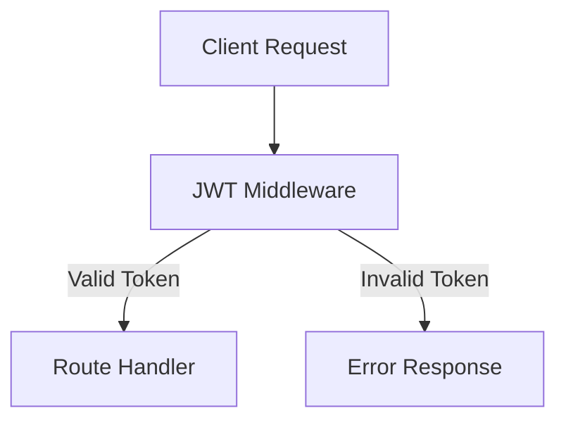

Here’s a detailed **Markdown breakdown with emojis** for Eden's walkthrough of the **To-Dos API** and its JWT-secured structure:

---

## ✅ To-Dos API Overview (with Auth0 + JWT Middleware)

This section introduces the structure, code, and purpose of a **JWT-protected API** that’s meant to be used alongside **Auth0 authentication** and hosted on **Cloudflare Workers** ☁️.

---

### 🧬 Monorepo Structure & Setup

#### 🧱 Cloning the Project

```bash
git clone https://github.com/cloudflare/cloudflare-ai.git
cd cloudflare-ai/demos/remote-mcp-auth0/todos-api
```

#### 📦 Installing Dependencies

```bash
npm install
```

---

### 🧭 Project Stack

| Component            | Purpose                                     |
| -------------------- | ------------------------------------------- |
| `Hono`               | Web server framework (lightweight, fast) ⚡ |
| `Faker`              | Generates fake/stub data for todos 📄       |
| `JWT Middleware`     | Validates access token and user scope 🛡️    |
| `Cloudflare Workers` | Serverless runtime for hosting the API ☁️   |

---

## 🛡️ Auth Flow: JWT + Middleware

### 🔐 What’s Validated?

The API uses custom middleware (`middleware/jwt.ts`) to:

- 🧾 Validate the incoming **JWT** token
- 🔐 Ensure it has the correct **scope** (like `read:todos`)
- ❌ Reject requests with missing/invalid tokens

### 📍 JWT Structure

Includes:

- `header`: Algorithm & key info
- `payload`: Claims about the user (like email, roles)

---

## 🧵 Routes Breakdown

### 📍 `GET /health`

- **Purpose**: Simple health check for uptime monitors
- ✅ No auth needed

---

### 📍 `GET /api/me`

- **Purpose**: Returns decoded user information from JWT payload
- 🔐 Protected by middleware

```ts
app.get('/api/me', (c) => {
  const payload = c.get('jwtPayload');
  return c.json(payload);
});
```

---

### 🧪 How Middleware Works

```ts
app.use('/api/*', async (c, next) => {
  // 1️⃣ Check JWT token from Authorization header
  // 2️⃣ Decode and verify signature
  // 3️⃣ Extract claims
  // 4️⃣ Set `jwtPayload` and `jwtHeader` to `c` (Hono context)
  // 5️⃣ Continue to endpoint if valid
});
```

If invalid:

- 🔥 Respond with error: `401 Unauthorized` or `403 Forbidden`

---

### 🧪 Example JWT Claims Returned from `/api/me`

```json
{
  "sub": "auth0|1234567890",
  "email": "ethan@example.com",
  "scope": "openid email read:todos"
}
```

---

## 🔄 Summary Flow



---

## 🚀 What’s Next?

In the upcoming videos:

- Run this API **locally**
- Configure with **Auth0 tenant**
- Deploy to **Cloudflare Workers**
- Test it with **MCP Remote** and agent queries like:

  > "What are my todos?"

---

Let me know if you’d like a **visual diagram** for the JWT request lifecycle or how this integrates with MCP clients!
